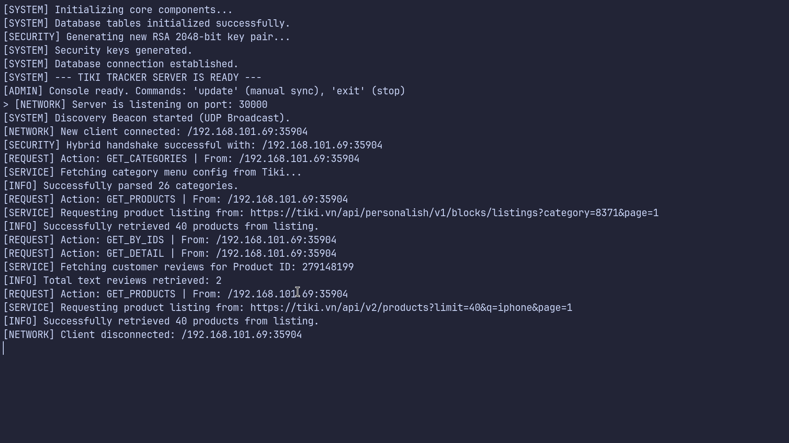
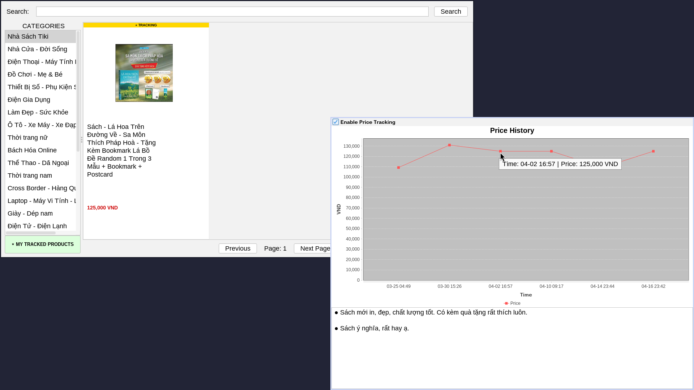

# 🚀 Tiki Price Tracker System

> A distributed Java-based system for tracking and visualizing product price history on Tiki.vn — built from scratch using low-level networking, custom security, and efficient data processing.

---

## 📌 Table of Contents
- [About The Project](#-about-the-project)
- [Features](#-features)
- [Tech Stack](#-tech-stack)
- [Architecture Overview](#-architecture-overview)
- [Getting Started](#-getting-started)
- [Usage](#-usage)
- [Technical Highlights](#-technical-highlights)
- [Project Structure](#-project-structure)
- [Roadmap](#-roadmap)
- [Contributing](#-contributing)
- [License](#-license)

---

## 📖 About The Project

**Tiki Price Tracker** is a distributed client-server system built entirely with Java Core that enables users to track, store, and visualize price fluctuations of products on Tiki.vn.

Unlike typical web-based solutions, this project focuses on **low-level system design**, implementing networking, security, and data processing from the ground up without relying on heavy frameworks.

It is designed to:
- Help users make smarter purchasing decisions during sales events
- Demonstrate strong backend, networking, and system design skills

---

## ✨ Features

- 📊 Track historical price changes of products
- 🔍 Monitor 4000+ products automatically
- 🖥️ Interactive desktop UI with data visualization
- 🔐 Secure communication using hybrid encryption (RSA + AES)
- ⚡ Zero-configuration client-server connection (UDP discovery)
- 🔄 Automatic background price updates every 3 hours
- 👤 Personalized tracking without login system
- 🛠️ Admin mode for global data access

---

## 🧰 Tech Stack

| Category        | Technology |
|----------------|------------|
| Language       | Java 21+ |
| Networking     | TCP Sockets, UDP Broadcast |
| Security       | RSA 2048-bit, AES 128-bit |
| Database       | SQLite + JDBC |
| UI             | Java Swing + FlatLaf + JFreeChart |
| Data Format    | JSON (Gson) |
| Build Tool     | Maven |
| Automation     | GitHub Actions |

---

## 🏗️ Architecture Overview

The system is divided into three independent modules:

### 1. 🖥️ Tracker Server
- Multi-threaded TCP server (Thread Pool)
- Handles client requests and database queries
- Runs background scheduler for price updates every 3 hours

### 2. 💻 Tracker Client
- Desktop GUI application
- Auto-discovers server via UDP broadcast (zero-config)
- Supports:
  - **User Mode** (personalized tracking)
  - **Admin Mode** (full database view)

### 3. 🤖 Standalone Crawler
- Crawls product data independently
- Handles 4000+ products per run
- Can be integrated with CI/CD (GitHub Actions)

---

## 🚀 Getting Started

### 📦 Download

Go to the latest release:
👉 https://github.com/ttasc/TikiPriceTracker/releases/latest

Download:
- `TikiTracker-Server.jar`
- `TikiTracker-Client.jar`
- `TikiTracker-Crawler.jar` (optional)

---

### ⚙️ Prerequisites

- Java 21 or higher

Check your version:
```bash
java -version
````

---

## ▶️ Usage

### 🖥️ Run Server

```bash
java -jar TikiTracker-Server.jar
```

**Optional flags:**

* `--console` → enable logging & command input (`update`, `exit`)
* `--disable-auto-update` → disable background updates

---

### 💻 Run Client

```bash
java -jar TikiTracker-Client.jar [server_ip] [--admin]
```

* If no IP is provided → auto-discovery via UDP broadcast
* `--admin` → view all tracked products (bypass personalization)

---

### 🤖 Run Crawler (Optional)

```bash
java -jar TikiTracker-Crawler.jar
```

* Crawls ~4000 products
* Takes ~30 minutes
* Can be automated using GitHub Actions

---

## 📸 Screenshots

### Server Logs



### Client UI



---

## ⚡ Technical Highlights

### 🔐 Secure Communication (Hybrid Encryption)

* RSA 2048-bit for key exchange
* AES 128-bit for data transmission
* Protects against packet sniffing (e.g., Wireshark)

---

### 🔄 Fault Tolerance & Rate Limiting

* Retry Queue for failed requests
* Exponential Backoff strategy
* Handles HTTP 403 / 429 errors effectively

---

### 🎯 UI Performance Optimization

* Asynchronous image loading (multi-threaded)
* Image caching with `ConcurrentHashMap`
* Database pagination (`LIMIT`, `OFFSET`)

---

### 👤 Zero-Login Personalization

* Local JSON file stores tracked product IDs
* Client-side filtering of server data
* No authentication system required

---

### 🌐 Zero-Configuration Networking

* UDP Broadcast for server discovery
* Eliminates manual IP configuration

---

## 📁 Project Structure

```
.
├── server/      # Tracker Server module
├── client/      # Desktop Client application
├── crawler/     # Data crawling module
├── imgs/        # Screenshots
└── releases/    # Built JAR files
```

---

## 🛣️ Roadmap

* [ ] Add REST API layer (optional web integration)
* [ ] Dockerize system deployment
* [ ] Improve UI/UX (modern UI framework)
* [ ] Add multi-user authentication system
* [ ] Cloud deployment (AWS / GCP)

---

## 🤝 Contributing

Contributions are welcome!

1. Fork the project
2. Create your feature branch:

   ```bash
   git checkout -b feature/YourFeature
   ```
3. Commit your changes:

   ```bash
   git commit -m "Add some feature"
   ```
4. Push to the branch:

   ```bash
   git push origin feature/YourFeature
   ```
5. Open a Pull Request

---

## 📄 License

This project is currently not licensed.
You can add a license such as MIT or Apache 2.0 in the future.

---

## 🙌 Acknowledgements

* Tiki.vn for product data inspiration
* Open-source libraries:

  * Gson
  * FlatLaf
  * JFreeChart

---

> 💡 This project is a strong demonstration of low-level system design, networking, and secure data handling in Java without relying on heavy frameworks.
